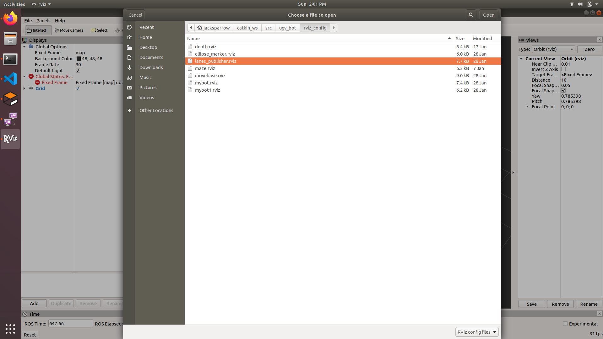
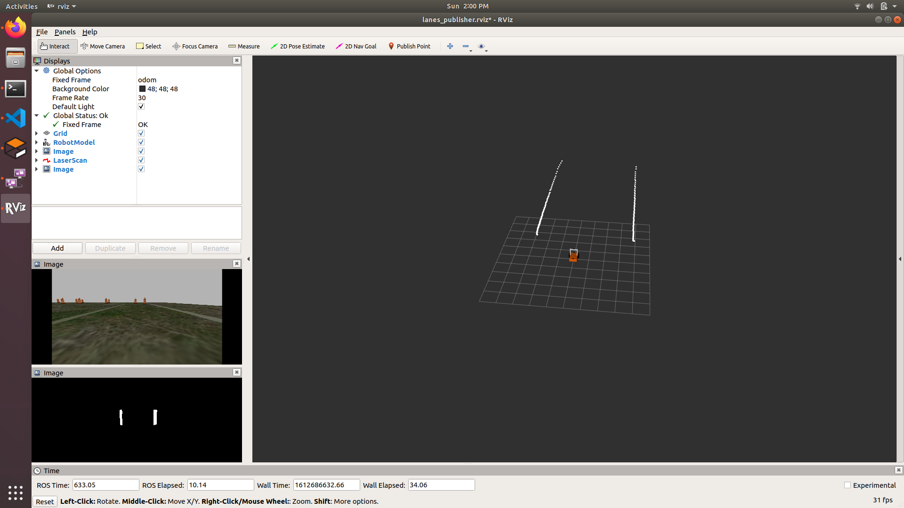
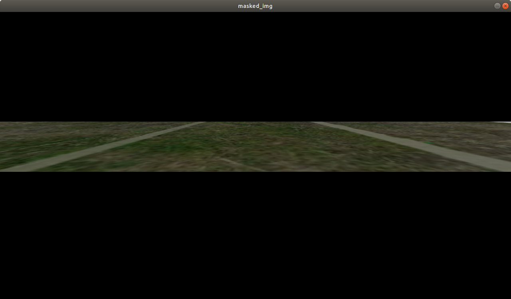
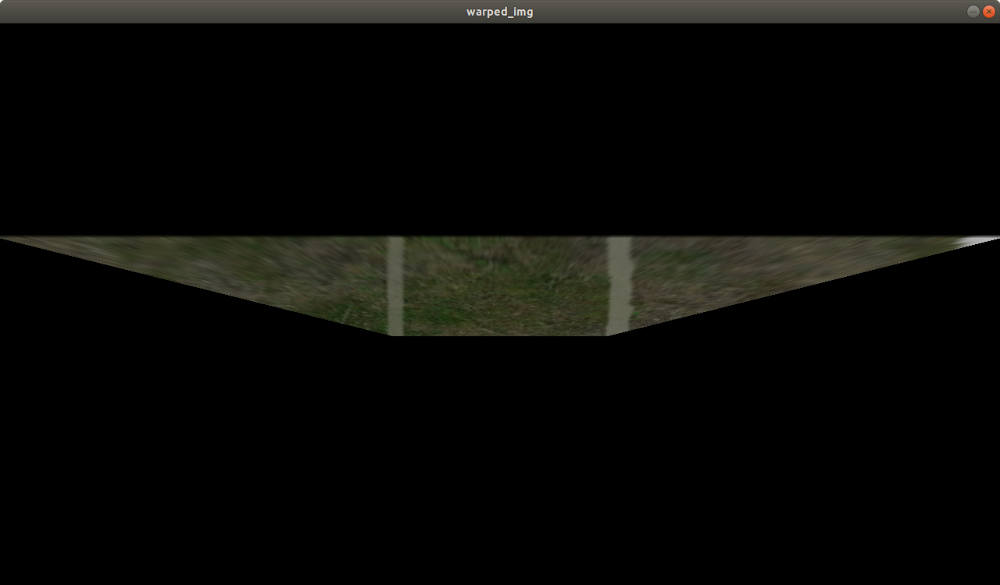
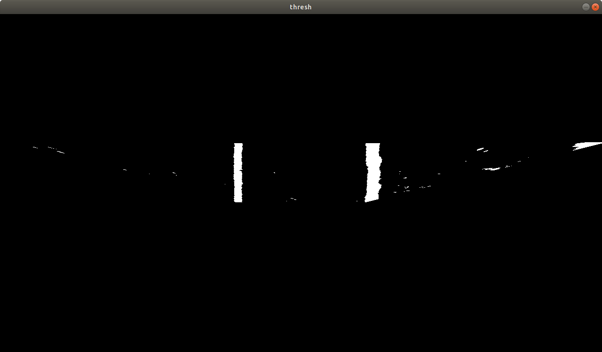
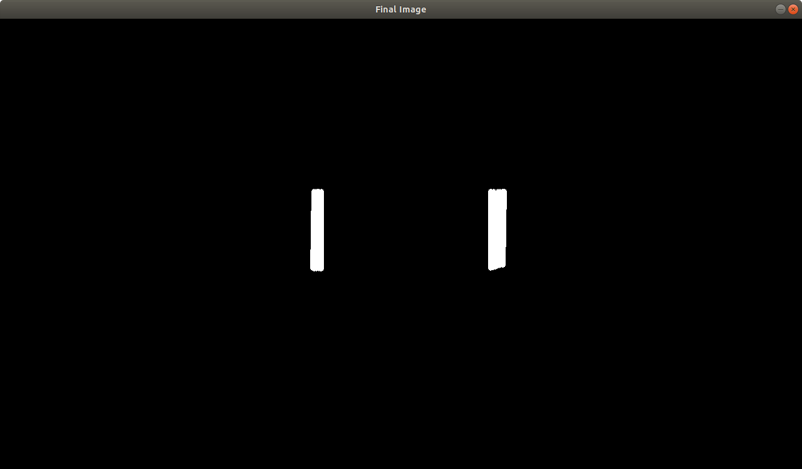
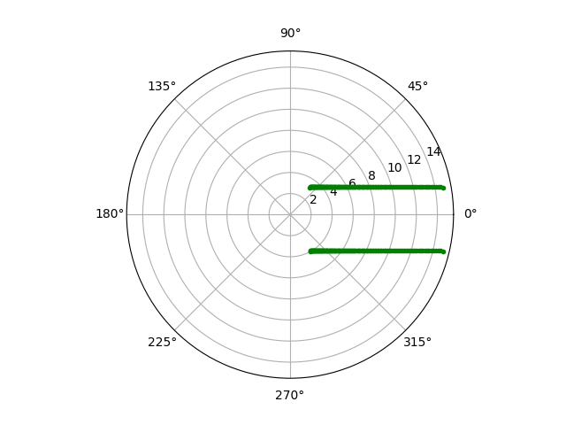

# Image Lanes to Laser Scan !!

>Uses a simple approach to extact lanes distance data,
>from image and convert it to a laser scan
>which will be published to rviz and can also be used for 
>mapping and localization packages such as costmap_2d or gmapping


## Running the scripts
- Launch the world using
  ```sh
  roslaunch ugv_bot ugvbot_world.launch
  ```
- Then Start the camera image subscriber service by command
  ```sh
  rosrun ugv_bot camera_img_server.py
  ``` 
- next open a new terminal tab by pressing ctrl+shift+tab \
  now run the image to laser scan script by command
  ```sh
  rosrun ugv_bot lanes_pub_using_srv.py
  ```
- After running these scripts, type rviz in new terminal, and open the lanes_publisher.rviz config file.
  
 
- After that your screen should look like 
  

# Explanation
>Main initiates a node named "Lanes_Processing_N_Publishing_service",
>which gets into image_client function to get latest image from "get_camera_image_service" server
>and returns the responce_data. This responce data is of compressedImage msg type,
>then the responce_data is passed to Image_Processor function

## Image_Processor()
>This function seperates the image data from message and does the following tasks.

1. Defines a mask and get the Region of interest using bitwise_and Operation.
  
  
2. Next transforms(warp) the image such that the straight lanes becomes straight lines as you can see below.  \
   In a sense this is the prespective transform of the image.
  
  
3. Now this image undergoes a binary thresholding for seperating the white pixels
  
    
4. To finally get only lanes in the image the hough transform is used.
  

   you can perform erode before hough transform which will decrease the lanes width, \
   after which hough transfrom will be less buggy.


> Before moving to the lanes to laser aspect, the final processed image is published to "/ugvbot/image_processed" topic via Img_msg_Publisher function.

## laser_processor()

>This function converts the lanes from the final image, to do so i used the following procedure:

1. First the coordinates of all the white pixels are stored in a list called "cord" using the function whitePixelSearch.

2. As these cordinates are in the image coordinate system i.e (0,0) on top left, we have to convert these wrt our bot which is at bottom mid in the image.
   Which can done by shifting the origin, but thats something a noobs will do. \
   I took a step forward and converted it to polar cordinates wrt bot, that is done in the cartToPolar function.
   If ploted it looks like.
  

3. Now the only task left is to convert these polar distances to real world polar disrances.

> which is done in the converterForRviz function

## converterForRviz()

>This function works on a basic assumption that the world is flat and in an image of this type of world 
>as we move from bottom to top the distances increases (for a purist increases exponentially with a equation of form *y = a.exp(bx)*),
>whose coeffiecints can be found by plotting the pixel value vs actual distance curve and using a curve fitting module.

1. The RCos(theta) i.e the distance in the longitudional direction is converted according to the exponential function, explained above.
2. The RSin(theta) i.e the distance in lateral direction is not so important in the near field and a linear curve will be a fairly good approximation,
   so it is converted linearly according to pixel to actual distances ratio.
   If plotted it should looks something like.
  
  
> Now the only thing left is to send this list of actual distances to rviz.
> We take the actual_polar list, and remap the angles to needed resolution by rounding off some data,
> then fill that data at appropriate location then pass that to datalaser_msg_publisher().

                                    WITH THAT ONE ITERATION OF THE LOOP IS COMPLETED
                                THIS WILL KEEP ON RUNNING UNTIL THE SERVER IS SENDING IMAGES

## Note

Again this method assumes that the world is flat, which means there are no objects with any kind of height in the image.
If there are such objects, then a workaround can be formalized :
1. Classify these types of objects
2. Crop out these Objects 
3. Publish the image to the same topic at which camera publishes, \
   with of course a higher refresh-rate than the camera. \
                      or \
   You can create another topic, in that case change the topic name in the camera_img_server script.

