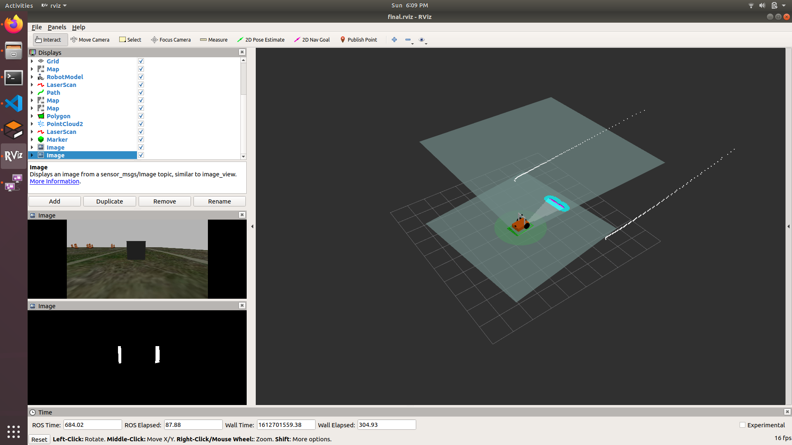
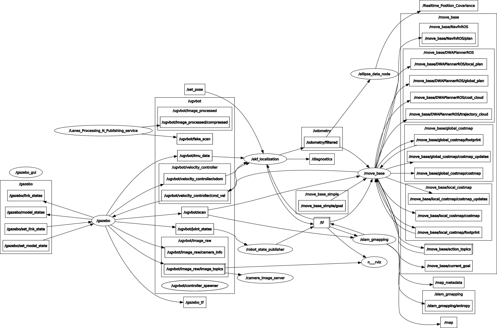
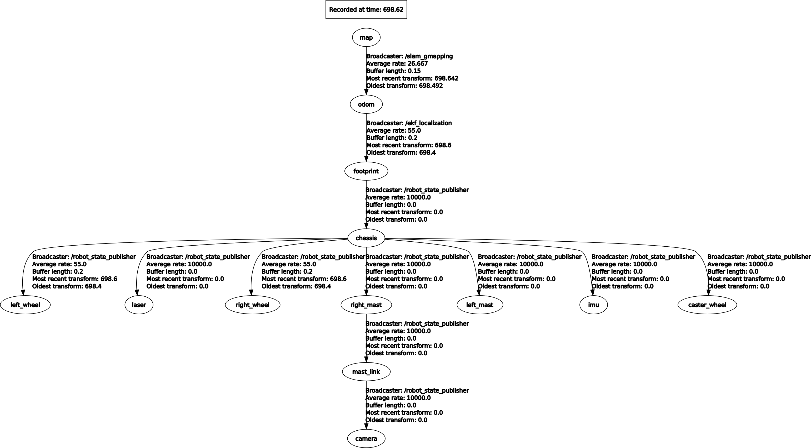

# Launching Sequence

- First Launch the world by
  ```sh
  roslaunch ugv_bot ugvbot_world.launch
  ```
 - Next launch the gmapping module
   ```sh 
   roslaunch ugv_bot ugvbot_gmapping.launch 
   ```
 - Finally launch the movebase / costmap2d module
   ```sh
   roslaunch ugv_bot ugvbot_movebase.launch 
   ```
Movebase launch file will also launch rviz with final.rivz configuration file, \
which should look something like this,
### RVIZ
  

### NODE_GRAPH
  

### TF_TREE
  


# Note !!!

- The laser coming from lanes are not used in gmapping and costmap but can be added, \
  and that is left as exercise for reader, 
  
                         LOL !! Now you have to read & configure both of these packages.. You lazy bitch.
                                   With that said dad has some other stuff to do, Goodbye son.
